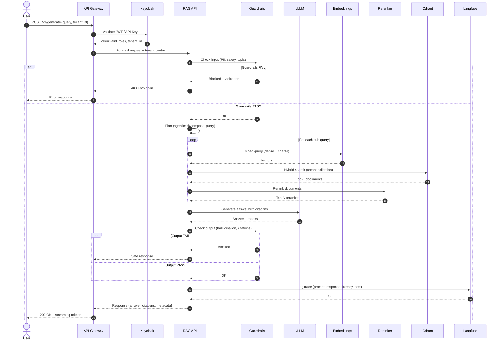
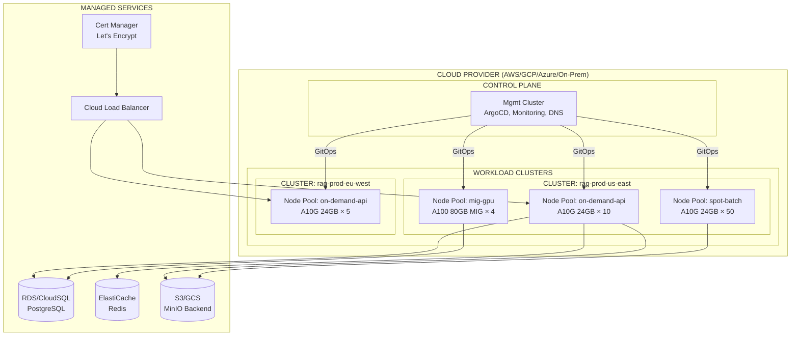
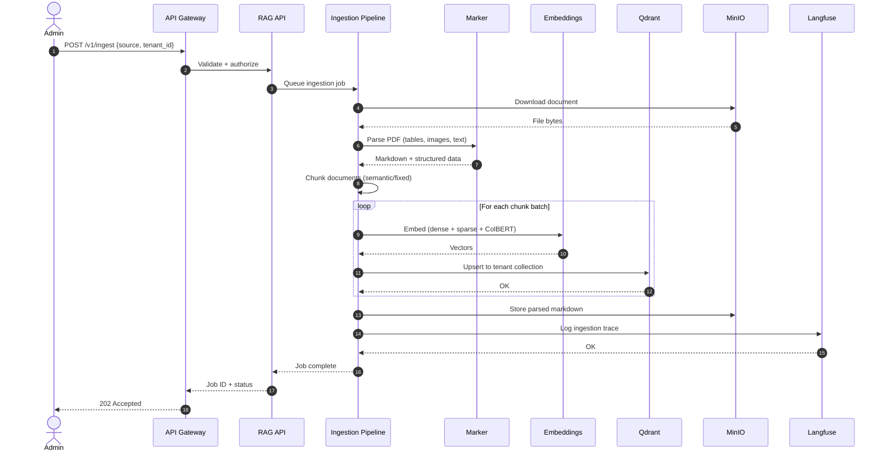
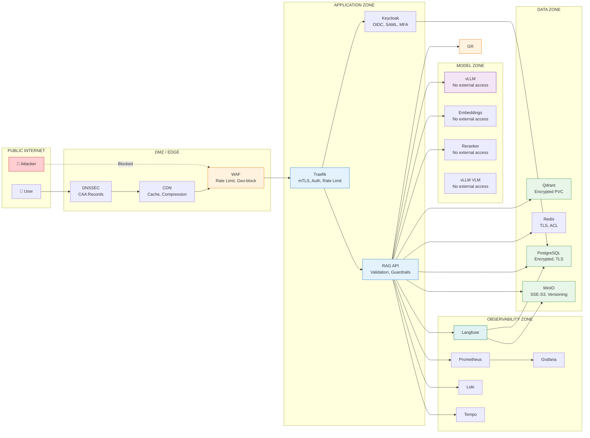

# Enterprise Agentic RAG — Architecture Diagram (Mermaid)

```mermaid
graph TB
    subgraph "CLIENT LAYER"
        UI[User Portal]
        API[API Client]
        SDK[SDK / LangChain]
    end

    subgraph "EDGE / PERIMETER"
        WAF[WAF / DDoS Protection]
        DNS[DNS / CDN]
        LB[Load Balancer<br/>NGINX / Traefik]
    end

    subgraph "API GATEWAY"
        GW[Traefik / Kong<br/>mTLS, Rate Limit, Auth Proxy]
    end

    subgraph "AUTH / IDENTITY"
        KC[Keycloak<br/>OIDC, SAML, RBAC]
        VAULT[HashiCorp Vault<br/>Secrets Management]
    end

    subgraph "RAG PLATFORM CORE"
        direction TB
        
        subgraph "TENANT A (Dedicated)"
            RA1[RAG API Pods]
            VLLM1[vLLM: Qwen2.5-32B]
            VLM1[vLLM: Qwen2-VL-7B]
            EMB1[txtai: BGE-M3]
            RR1[txtai: BGE-Reranker]
            QD1[Qdrant Cluster]
            MN1[MinIO Bucket]
        end

        subgraph "TENANT B (Professional - MIG)"
            RA2[RAG API Pods]
            VLLM2[vLLM: Qwen2.5-14B]
            VLM2[vLLM: Qwen2-VL-2B]
            EMB2[txtai: BGE-M3]
            RR2[txtai: BGE-Reranker]
            QD2[Qdrant DB]
            MN2[MinIO Bucket]
        end

        subgraph "TENANT C...N (Shared Starter)"
            RA3[RAG API Pods]
            VLLM3[vLLM: Qwen2.5-7B]
            EMB3[txtai: BGE-M3]
            RR3[txtai: BGE-Reranker]
            QD3[Qdrant Partitions]
            MN3[MinIO Prefix]
        end
    end

    subgraph "SHARED SERVICES"
        PARSE[Marker PDF Parser]
        GR[Guardrails AI]
        ING[Ingestion Pipeline]
        TO[Tenant Operator]
    end

    subgraph "DATA LAYER"
        PG[(PostgreSQL<br/>Keycloak, Langfuse, Platform)]
        REDIS[(Redis<br/>Cache, Rate Limit, Queue)]
    end

    subgraph "OBSERVABILITY"
        LF[Langfuse<br/>LLM Traces, Evals, Costs]
        PROM[Prometheus<br/>Metrics]
        GRAF[Grafana<br/>Dashboards]
        LOKI[Loki<br/>Logs]
        TEMPO[Tempo<br/>Traces]
    end

    subgraph "CONTROL PLANE"
        ARGO[ArgoCD / Flux<br/>GitOps]
        KUSTOMIZE[Kustomize<br/>Multi-env Config]
        MONITOR[Alertmanager<br/>PagerDuty, Slack]
    end

    %% Connections
    UI --> DNS
    API --> DNS
    SDK --> DNS
    DNS --> WAF
    WAF --> LB
    LB --> GW
    
    GW -->|Auth| KC
    GW -->|Rate Limit| REDIS
    GW -->|Route| RA1
    GW -->|Route| RA2
    GW -->|Route| RA3
    
    RA1 -->|Query| VLLM1
    RA1 -->|Query| VLM1
    RA1 -->|Embed| EMB1
    RA1 -->|Rerank| RR1
    RA1 -->|Search| QD1
    RA1 -->|Store| MN1
    RA1 -->|Guardrails| GR
    RA1 -->|Trace| LF
    RA1 -->|Metrics| PROM
    RA1 -->|Logs| LOKI
    RA1 -->|Trace| TEMPO
    
    RA2 -->|Query| VLLM2
    RA2 -->|Query| VLM2
    RA2 -->|Embed| EMB2
    RA2 -->|Rerank| RR2
    RA2 -->|Search| QD2
    RA2 -->|Store| MN2
    RA2 -->|Guardrails| GR
    RA2 -->|Trace| LF
    
    RA3 -->|Query| VLLM3
    RA3 -->|Embed| EMB3
    RA3 -->|Rerank| RR3
    RA3 -->|Search| QD3
    RA3 -->|Store| MN3
    RA3 -->|Guardrails| GR
    RA3 -->|Trace| LF
    
    ING --> PARSE
    ING --> EMB1
    ING --> QD1
    ING --> MN1
    
    TO --> KC
    TO --> QD1
    TO --> QD2
    TO --> MN1
    TO --> MN2
    TO --> PG
    
    LF --> PG
    LF --> MN1
    PROM --> GRAF
    PROM --> MONITOR
    
    ARGO -.->|Deploy| GW
    ARGO -.->|Deploy| RA1
    ARGO -.->|Deploy| RA2
    ARGO -.->|Deploy| RA3
    ARGO -.->|Deploy| VLLM1
    ARGO -.->|Deploy| QD1
    ARGO -.->|Deploy| MONITOR

    %% Styling
    classDef tenantA fill:#e3f2fd,stroke:#1976d2,stroke-width:2px;
    classDef tenantB fill:#e8f5e9,stroke:#388e3c,stroke-width:2px;
    classDef tenantC fill:#fff3e0,stroke:#f57c00,stroke-width:2px;
    classDef shared fill:#f3e5f5,stroke:#7b1fa2,stroke-width:1px,stroke-dasharray: 5 5;
    classDef data fill:#eceff1,stroke:#546e7a,stroke-width:2px;
    classDef obs fill:#e0f2f1,stroke:#00695c,stroke-width:2px;
    classDef control fill:#fce4ec,stroke:#c2185b,stroke-width:2px;
    
    class RA1,VLLM1,VLM1,EMB1,RR1,QD1,MN1 tenantA;
    class RA2,VLLM2,VLM2,EMB2,RR2,QD2,MN2 tenantB;
    class RA3,VLLM3,EMB3,RR3,QD3,MN3 tenantC;
    class PARSE,GR,ING,TO shared;
    class PG,REDIS data;
    class LF,PROM,GRAF,LOKI,TEMPO obs;
    class ARGO,KUSTOMIZE,MONITOR control;
```



---

## Component Interaction Flow (Sequence Diagram)



---

## Tenant Isolation Model

```mermaid
graph TB
    subgraph "SHARED INFRASTRUCTURE"
        GW[API Gateway]
        KC[Keycloak]
        LF[Langfuse]
        PROM[Prometheus]
        GR[Guardrails]
        PARSE[Marker]
        TO[Tenant Operator]
    end

    subgraph "TENANT ISOLATION LAYERS"
        L1[Network Policies<br/>K8s NetworkPolicy per tenant]
        L2[K8s Namespaces<br/>tenant-{id} namespace]
        L3[Qdrant Collections<br/>tenant_{id} collection]
        L4[MinIO Buckets<br/>tenant-{id}/ prefix]
        L5[Keycloak Realms/Clients<br/>Per-tenant realm or client]
        L6[Resource Quotas<br/>CPU, RAM, GPU, Storage]
        L7[RBAC Roles<br/>tenant-admin, user, query]
        L8[Encryption Keys<br/>Per-tenant KMS keys]
    end

    GW -.->|Route by tenant| L1
    L1 --> L2
    L2 --> L3
    L2 --> L4
    L2 --> L5
    L2 --> L6
    L2 --> L7
    L2 --> L8

    style L1 fill:#ffebee,stroke:#c62828
    style L2 fill:#ffebee,stroke:#c62828
    style L3 fill:#ffebee,stroke:#c62828
    style L4 fill:#ffebee,stroke:#c62828
    style L5 fill:#ffebee,stroke:#c62828
    style L6 fill:#ffebee,stroke:#c62828
    style L7 fill:#ffebee,stroke:#c62828
    style L8 fill:#ffebee,stroke:#c62828
```

---

## Deployment Architecture



---

## Data Flow: Document Ingestion



---

## Security Boundaries

